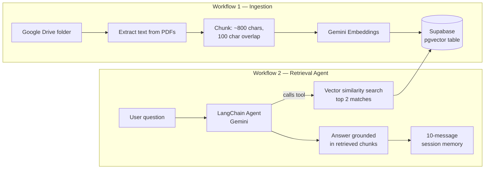
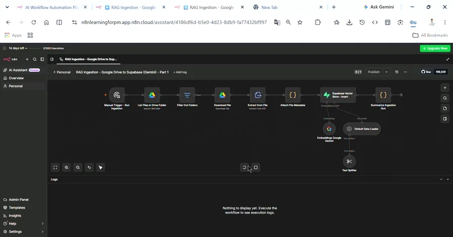
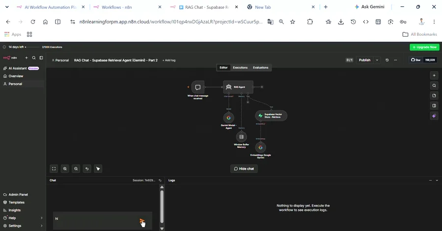
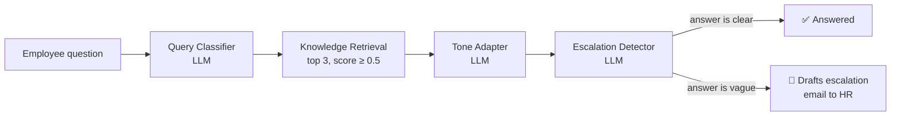
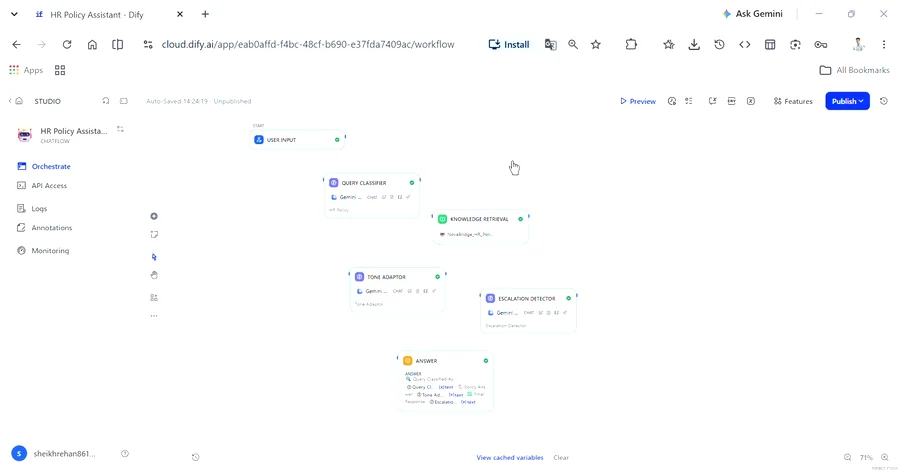

<div align="center">

# 🧩 RAG Agentic Builds — n8n + Dify

### Three no-code/low-code agentic workflows exploring two different retrieval-augmented generation architectures — self-hosted vector search vs. a managed multi-node agent


![Original Workflow] **[Ingestion Agent](assets/RAG%20Ingestion%20-Agent.json) · [Retrieval Agent](assets/RAG%20Chat%20-%20Supabase%20Retrieval%20Agent.json) · [Dify HR Agent](assets/HR%20Policy%20Assistant%20dify.yml)**

</div>

---

## TL;DR

Two different ways to build a "search my own documents" AI system, built hands-on rather than just read about: a **self-hosted RAG pipeline** (n8n + Supabase pgvector — I own the ingestion, chunking, and retrieval logic) and a **managed multi-node agent** (Dify — a 5-step reasoning pipeline that classifies intent, retrieves grounded context, adapts tone, and escalates when the answer isn't good enough). Same underlying problem, two genuinely different architectural tradeoffs — which is the actual point of building both.

**My role:** hands-on builder — designed the retrieval architecture, wrote the system prompts, and tested all three workflows end to end with real documents.

---

## 📖 Table of Contents

- [Why Two Architectures](#-why-two-architectures)
- [Build 1 & 2 — Self-Hosted RAG (n8n + Supabase)](#-build-1--2--self-hosted-rag-n8n--supabase)
- [Build 3 — Multi-Node HR Agent (Dify)](#-build-3--multi-node-hr-agent-dify)
- [Prompt Design](#️-prompt-design)
- [What This Demonstrates](#-what-this-demonstrates)

---

## 🔍 Why Two Architectures

"RAG" isn't one thing — it's a spectrum of build-vs-buy tradeoffs. I built both ends of it on purpose:

| | Self-hosted (n8n + Supabase) | Managed (Dify) |
|---|---|---|
| **Who owns chunking/embeddings** | Me — explicit chunk size, overlap, embedding model | The platform — abstracted away |
| **Retrieval logic** | Custom SQL similarity function I control | Built-in retrieval node, configured not coded |
| **Best for** | Full control, custom scoring, multi-step agent logic | Fast iteration, non-technical stakeholders, structured multi-step reasoning |
| **What I actually configured** | Vector table schema, HNSW index, chunk overlap, topK | Node-by-node prompts, tone-detection logic, escalation rules |

Understanding *when* each tradeoff makes sense — not just being able to use either tool — is the actual product-thinking exercise here.

---

## 🏗 Build 1 & 2 — Self-Hosted RAG (n8n + Supabase)

Two paired n8n workflows that together form one complete RAG system: one builds the knowledge base, the other searches it.



**Design decisions that mattered:**

- **Chunk size (800 chars, 100 overlap)** — small enough that each chunk stays topically coherent for embedding, with enough overlap that a fact split across a chunk boundary isn't lost entirely
- **Same embedding model on both sides, non-negotiable** — ingestion and retrieval both use `gemini-embedding-2` at a fixed 3072 dimensions. Mixing embedding models between ingest and retrieval silently breaks similarity search — vectors from different models aren't comparable, and there's no error, just bad results
- **topK = 2, not more** — deliberately narrow. Retrieval-augmented answers are only as trustworthy as their source; pulling in more chunks "just in case" dilutes relevance rather than helping the model
- **The agent is instructed to say when it doesn't know** — the system prompt explicitly requires the agent to acknowledge when retrieved content is insufficient rather than fill the gap with general knowledge. This is the single most important line in the whole build: a RAG system that quietly answers from parametric knowledge when retrieval comes up empty is more dangerous than one that visibly fails

A third pattern is documented but not demoed here: a **Pinecone Assistant relay** variant, where n8n's only job is passing chat messages to a hosted Pinecone Assistant that owns ingestion and retrieval entirely — the alternative end of the build-vs-buy spectrum, for teams that would rather not manage chunking and a vector database themselves.

**Ingestion in action** — Google Drive → chunked → embedded → written into the Supabase `documents` table:

<p align="center">

</p>

<p align="center"><sub><a href="assets/Rag_ingest.mp4">▶️ Full-length version (Rag_ingest.mp4)</a></sub></p>

**Retrieval agent in action** — a live grounded conversation over the ingested documents, including follow-up questions that rely on session memory:

<p align="center">

</p>

<p align="center"><sub><a href="assets/Rag_retrive_.mp4">▶️ Full-length version (Rag_retrive_.mp4)</a></sub></p>

---

## 🤖 Build 3 — Multi-Node HR Agent (Dify)

A 4-node reasoning pipeline that mimics how an actual HR team would triage a question — classify, retrieve, adapt tone, and know when to escalate — visible as discrete steps rather than one opaque LLM call.



**What each node actually does:**

| Node | Job |
|---|---|
| **Query Classifier** | Tags the question into one of 5 categories (leave policy, compensation, code of conduct, reimbursement, escalation) with a one-sentence reason |
| **Knowledge Retrieval** | Searches the uploaded policy PDF, `topK=3`, score threshold `0.5` to filter out loosely-related chunks |
| **Tone Adapter** | Detects the *right* register for the question — plain English for routine questions, formal HR language for disciplinary/legal matters, friendly conversational for exploratory questions — then writes the answer in that tone |
| **Escalation Detector** | Quality-checks the generated answer; if it's vague or just says "contact HR," it discards that answer and drafts a ready-to-send escalation email instead |

The "wow moment" this was built around: one employee question visibly passes through four distinct reasoning steps in a few seconds — the same triage a human HR generalist would do, just fast enough to feel instant.

**Pipeline in action** — a question flowing through classification, retrieval, tone adaptation, and escalation-checking:

<p align="center">

</p>

<p align="center"><sub><a href="assets/Defy_HR_Policy_agent.mp4">▶️ Full-length version (Defy_HR_Policy_agent.mp4)</a></sub></p>

---

## ✍️ Prompt Design

Two prompts worth calling out specifically, because they're solving different problems.

**Tone detection (Tone Adapter node)** — a single prompt handles three-way tone branching without needing three separate prompts or a router node:

```text
FIRST — detect the appropriate tone based on the question's intent:
- Factual and routine (leave balance, claim process) → Simple Plain English
- Serious matter (disciplinary, termination, legal) → Official HR Language
- Casual or exploratory ("can I", "is it okay to") → Friendly Conversational

THEN — write the answer in that detected tone using only the
policy content provided.
```

Keeping detection and generation in one prompt (rather than a separate classifier node feeding a generator node) kept the pipeline at 4 nodes instead of 6, while still producing three genuinely different writing styles depending on intent.

**Escalation logic (Escalation Detector node)** — the more interesting design choice is what happens when the pipeline *fails* gracefully:

```text
If NO (the answer is vague, says "not specified", "contact HR", or
doesn't directly address the question) — do not output the answer.
Instead, draft a professional escalation email the employee can
send to HR.
```

This mirrors the same principle as the n8n retrieval agent's instruction to admit uncertainty: **a policy chatbot that confidently gives a bad answer is worse than one that hands the employee a ready-drafted email to a real person.** Building the failure path with the same care as the success path is the actual design decision here, not an edge case bolted on afterward.

---

## 🎓 What This Demonstrates

- **Build-vs-buy fluency** — same underlying RAG problem, deliberately solved two different ways to understand the real tradeoffs, not just to compare tools
- **Retrieval architecture literacy** — chunk sizing, embedding-model consistency, and topK aren't abstract concepts here; they're specific configuration choices with visible consequences
- **Designing for graceful failure** — both builds treat "I don't have a confident answer" as a first-class outcome, not something to paper over with a fluent-sounding guess
- **Multi-step agent design** — breaking one HR question into 4 discrete, inspectable reasoning steps instead of one opaque prompt, because each step is independently testable and debuggable

---

<div align="center">

I'm a **Chemical Engineer transitioning into AI Product Management**, and I build hands-on with the underlying tools — not just the polished product layer — to understand the real tradeoffs behind AI product decisions.

📂 More case studies and projects on my [GitHub profile](https://github.com/Rehansheikh787).

</div>
